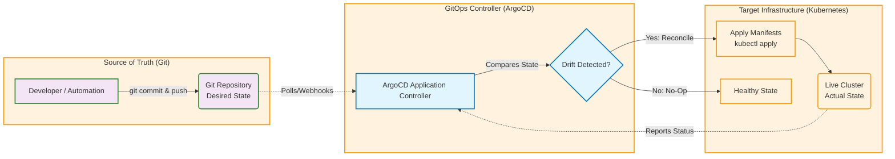

# Diagrams for "GitOps at Scale: Managing Multi-Cluster Kubernetes with ArgoCD"

## The GitOps Workflow: Commit, Reconcile, Deploy

This diagram illustrates the continuous reconciliation loop that is the core of the GitOps operating model.

