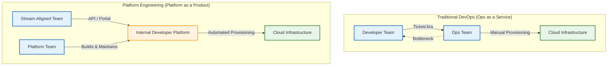

# Diagrams for "The Ultimate Guide to DevOps Automation in 2025"

## Traditional Ops vs. Platform Engineering

This diagram illustrates the fundamental shift from a ticket-based, high-friction model to a self-service, API-driven platform model.

